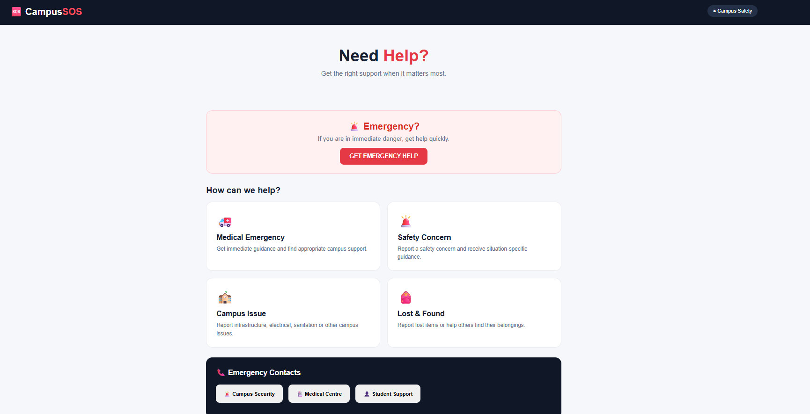
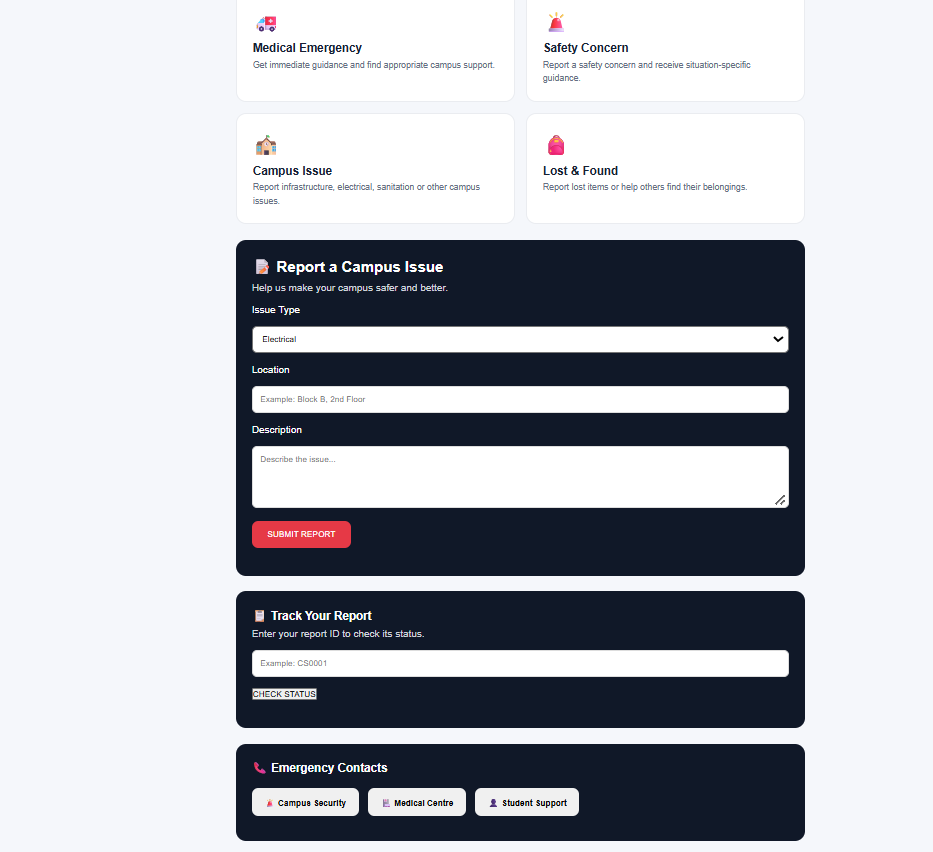
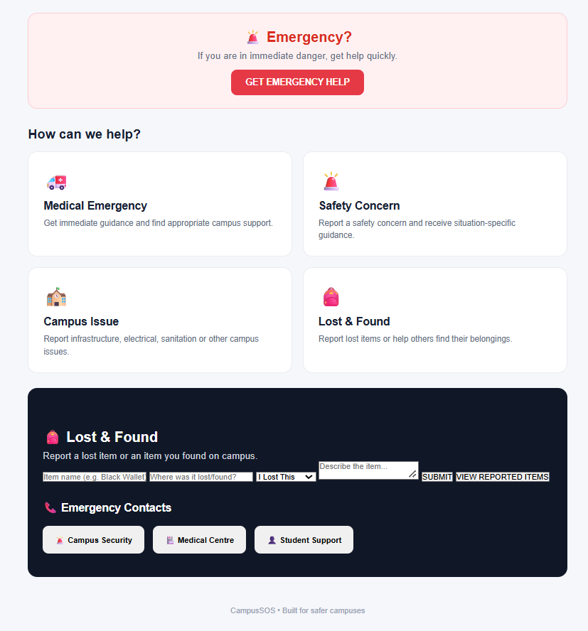
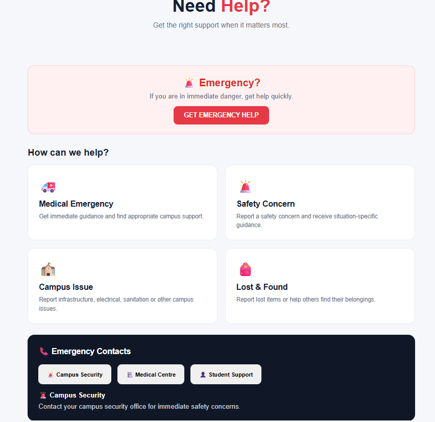

# 🚨 CampusSOS

A simple campus safety and student support platform designed to help students report campus issues, track reports, and manage lost & found items.

## ✨ Features

* 🚨 **Emergency Help**

  * Medical guidance
  * Safety guidance
  * General emergency guidance

* 🏫 **Campus Issue Reporting**

  * Report electrical, infrastructure, sanitation, water, and other issues
  * Generates a unique report ID
  * Track report status

* 📋 **Report Tracking**

  * Search reports using the generated report ID
  * Shows current report status

* 🎒 **Lost & Found**

  * Report lost or found items
  * View previously reported items
  * Generates a unique Lost & Found ID
  * Data is stored using SQLite

* 📞 **Emergency Contacts**

  * Campus Security
  * Medical Centre
  * Student Support

* 📱 **Mobile-Friendly UI**

  * Responsive layout for smaller screens

## 🛠️ Technology Stack

* Python
* Flask
* SQLite
* HTML
* CSS
* JavaScript

## ▶️ How to Run

### 1. Clone the repository

```bash
git clone https://github.com/sharmilachilamakuri-web/CampusSOS.git
cd CampusSOS
```

### 2. Create a virtual environment

```bash
python -m venv venv
```

### 3. Install Flask

```bash
venv\Scripts\python.exe -m pip install flask
```

### 4. Run the application

```bash
venv\Scripts\python.exe app.py
```

Open the application in your browser:

```text
http://127.0.0.1:5000
```

## 💡 Project Goal

CampusSOS aims to provide students with a simple central place for campus safety support, issue reporting, report tracking, and lost & found management.

## 🔐 Data

CampusSOS uses a local SQLite database for storing reports and Lost & Found submissions.

The local database file and virtual environment are excluded from Git using `.gitignore`.
The local database file and virtual environment are excluded from Git using `.gitignore`.
## 📸 Screenshots

### 🏠 CampusSOS Home



### 🏫 Campus Issue Reporting



### 🎒 Lost & Found



### 🚨 Emergency Help & Contacts


